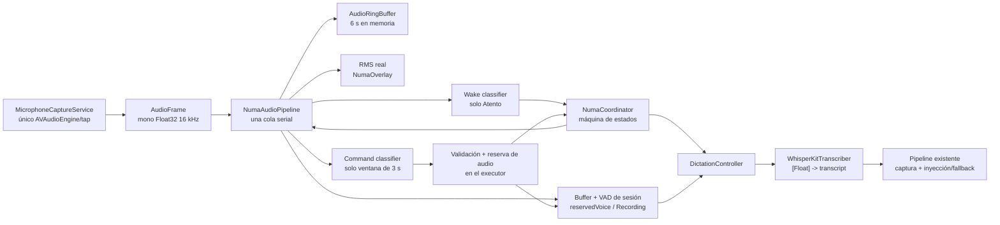

# Plan 05 — Numa: activación por voz y dictado manos libres

**Estado:** contrato de producto cerrado; listo para ejecutar por fases.

**Fecha:** 2026-07-14.

**Plataforma de esta primera entrega:** Apple Silicon y el macOS de desarrollo actual (26.x).

**Importante:** este documento es normativo. Si el código actual, una suposición del agente o una solución más fácil contradicen este plan, gana este plan.

## 1. Resultado esperado

Numa es el nuevo nombre visible del producto y también el nombre de activación predeterminado. La aplicación permanece ejecutándose como proceso accesorio aunque el panel esté oculto.

Flujo principal:

1. La aplicación arranca con la escucha de activación en estado **Atento**.
2. El usuario dice `Numa`.
3. En cuanto se detecta el nombre aparece un overlay no activante, centrado abajo en la pantalla de trabajo, con una onda alimentada por el nivel real del micrófono y un tono opcional.
4. Numa abre una ventana exacta de 3 segundos para el comando.
5. El único comando válido en esta entrega es `graba audio`.
6. Al aceptarlo se inicia el mismo dictado manos libres que inicia `⌥L`; no se simula ninguna tecla.
7. El usuario puede continuar sin pausa: `Numa, graba audio, mañana tenemos…`. No se puede perder `mañana` ni insertar `Numa, graba audio` en el destino.
8. El dictado termina con una segunda pulsación de `⌥L` o automáticamente tras silencio.
9. La transcripción se entrega mediante el pipeline de destino existente. No se envía ni se pulsa Return.
10. Al terminar, Numa vuelve a **Atento**.

El flujo debe funcionar igual con el panel de teclado visible u oculto.

## 2. Contrato de producto cerrado

Estas decisiones no están abiertas a reinterpretación durante la implementación:

- Nombre visible del producto: **Numa**.
- Nombre de activación predeterminado: **Numa**.
- Cualquier voz puede activarlo; no hay reconocimiento o enrolamiento de hablante.
- Sensibilidad alta para el nombre de activación y umbral estricto para ejecutar el comando.
- Un falso wake solo muestra el overlay; no inicia una acción.
- Solo se acepta el comando canónico `graba audio`. No hay sinónimos, aliases ni lenguaje natural.
- `manda`, abrir aplicaciones, controlar Codex, comandos remotos y un intérprete LLM quedan fuera de alcance.
- La ventana de comando dura 3 segundos desde el evento que acepta el wake y ordena mostrar el overlay; no desde el final de la ventana acústica que originó el callback, por lo que la latencia de inferencia previa no roba tiempo.
- Si no se reconoce el comando, se muestra `No te he entendido` durante 1,2 segundos y se vuelve a Atento sin ejecutar nada.
- El overlay no roba foco y aparece sobre Spaces y apps a pantalla completa.
- El destino se captura al aceptar `graba audio` o al pulsar `⌥L`, no al detectar `Numa`.
- Un campo editable externo capturado gana. Si no existe, se usa el compositor conservando texto, selección y cursor existentes.
- Nunca se envía el texto ni se dispara `⌘↩`/Return.
- El push-to-talk existente no cambia. En este Mac está configurado como `⌥B`, aunque el default del código siga siendo `⌃⌥Espacio`; no se debe migrar ni sobrescribir `Settings.dictationHotKey*`.
- Se añade un atajo distinto y configurable para manos libres: `⌥L` por defecto.
- Primera pulsación de `⌥L`: inicia manos libres. Segunda: termina. La release de la tecla no hace nada.
- Tras iniciar manos libres hay hasta 5 segundos para comenzar a hablar.
- Una vez detectada voz, 2 segundos continuos de silencio terminan la grabación.
- Mientras se graba o transcribe no se procesa ningún wake word.
- El estado manual Pausado solo dura el proceso actual. Cada nuevo arranque empieza Atento; no se persiste ese estado.
- Al bloquear sesión o dormir el Mac se detiene el micrófono. Al desbloquear/despertar se reanuda solo si el usuario no había pausado Numa.
- Numa intenta registrarse para arrancar al iniciar sesión en macOS.
- Toda la detección de nombre y comando es local, sin cuenta, API key ni fallback de red, y sus modelos van dentro de la app.
- La escucha permanente no se guarda ni se envía. Solo existe un ring buffer acotado en memoria.
- Los eventos de Numa no registran audio, texto reconocido, transcripciones, contenido de destino ni nombre de aplicación.
- Temas sonoros: `Cristal`, `Pulso`, `Orgánico`, `Digital` y `Sin sonido`. Cada tema no silencioso tiene un sonido de activación y otro de fin.
- La experiencia visible se renombra a Numa. Para preservar permisos y datos se mantienen inicialmente el bundle id `com.jon.glideboard`, la identidad `GlideBoard Signing`, los targets/módulos/ejecutable internos y las carpetas existentes de Application Support.

## 3. Nombre de activación configurable

Se acordó que en el futuro se podrá seleccionar otro nombre de una lista y que solo habrá **uno activo a la vez**.

Reglas de implementación:

- No permitir texto libre: cada nombre necesita su propio modelo acústico validado.
- Añadir `WakeWordCatalog`, alimentado por un manifiesto de recursos, no por un `switch` repartido por la UI.
- Persistir únicamente `activeWakeWordID`; default `numa`.
- La marca de la app sigue siendo Numa aunque se elija otro nombre de activación.
- El popup de Ajustes solo muestra entradas cuyo modelo, model card y hash estén incluidos y sean cargables.
- Esta primera entrega exige y valida `Numa`. No se deben inventar nombres adicionales ni mostrar opciones sin modelo. Añadir otro nombre después debe ser una operación de datos/modelo, no una reescritura de arquitectura.
- Cambiar de nombre detiene la escucha, carga el nuevo modelo, limpia analizadores/ring buffer y vuelve al estado base derivado (normalmente Atento; Pausado sigue Pausado). Si falla, revierte a la selección anterior y muestra el error.

Schema mínimo por entrada del catálogo: `id`, `displayName`, `transcriptForms` (arrays de tokens permitidos para recortar el pre-roll), ruta/hash/card del wake model y compatibilidad con el command model. La entrada inicial es `id: "numa"`, display `Numa`, forms `[["numa"]]`. Tests pueden inyectar una segunda entrada fake para demostrar que loader/UI/trimmer son data-driven, pero el bundle de esta entrega no la muestra sin modelo validado.

## 4. Alcance y no alcance

### Incluido

- Wake word local.
- Comando fijo local `graba audio`.
- Overlay estilo asistente, sin activar la app.
- Atajo toggle `⌥L` y parada por VAD.
- Reutilización del dictado WhisperKit y de la entrega existente.
- Pausa de escucha, lifecycle de sesión/sueño, inicio al login.
- Catálogo de nombres, con Numa como primer recurso validado.
- Sonidos configurables.
- Rebranding visible.
- Pruebas rápidas, corpus acústico separado, contratos de privacidad/bundle y métricas live.

### Excluido

- `manda` o cualquier acción posterior al dictado.
- Abrir Codex u otras apps por voz.
- Sinónimos (`empieza a grabar`, `dicta`, etc.).
- Conversación libre o interpretación mediante LLM.
- Identificación de hablante.
- Varios nombres activos simultáneamente.
- Grabación de audio de depuración implícita.
- Intel y versiones antiguas de macOS como matriz soportada en esta fase.
- Empaquetar el modelo grande de WhisperKit. El núcleo de activación (wake + comando) sí debe venir empaquetado; el modelo de transcripción conserva por ahora su descarga local bajo demanda existente.

## 5. Baseline que no se puede romper

El repositorio ya tiene un dictado usable y una entrega compleja que deben reutilizarse:

- `AppDelegate` compone hotkeys, `DictationController`, overlay, captura de destino y entrega.
- `DictationController` implementa hoy press/release.
- `WhisperKitDictationEngine` abre su propio `AudioProcessor`, acumula muestras y transcribe.
- `captureDictationTarget()` y `CapturedTextTarget` conservan el campo, selección y app originales.
- La entrega reintenta activación/foco, evita modifiers físicos, escribe en AppKit/Electron y cae al compositor sin borrar su borrador.
- `dictationSessionID` ya protege parte de los callbacks tardíos.
- `DictationOverlay` ya usa un `NSPanel` no activante, pero siempre se posiciona en `NSScreen.main` y dibuja una onda ficticia.
- Los Carbon IDs actuales son 1 toggle, 2 foco, 3 transform, 4 push-to-talk y 5 send.
- El runner canónico es `./test.sh`, no XCTest ni `swift test`.
- Baseline verificado al redactar este plan: **99 checks pasan**.

Invariantes:

- No reescribir la entrega de texto salvo los nombres visibles y el punto desde el que se la invoca.
- No convertir push-to-talk en toggle.
- No resetear la preferencia existente del atajo de dictado.
- No crear dos capturas de micrófono.
- No ejecutar todos los scripts antiguos de `Tests/*.sh` en bloque: varios conservan paths obsoletos. El gate rápido es `./test.sh` y los scripts nuevos de Numa se ejecutan explícitamente.

## 6. Decisión del motor acústico y gate obligatorio

### 6.1 Motor elegido

Usar dos clasificadores binarios propios:

- `NumaWake.mlmodel`: labels `numa` y `other`.
- `NumaCommand.mlmodel`: labels `graba_audio` y `other`.

Runtime del sistema:

- `AVFAudio` con un único `AVAudioEngine` propio para la captura permanente.
- `CoreML` para cargar el modelo.
- `SoundAnalysis` (`SNAudioStreamAnalyzer` + `SNClassifySoundRequest`) para analizar el stream.
- `CreateML` solo como herramienta de entrenamiento, fuera del runtime.

No añadir una dependencia de reconocimiento de terceros. Se descartan:

- `SpeechAnalyzer`/`DictationTranscriber`: sirven como baseline, pero Apple administra/descarga el asset y no cumplen “modelo incluido”.
- Porcupine: exige AccessKey.
- openWakeWord: no tiene runtime Swift oficial completo, su soporte/modelos publicados son ingleses y las licencias de modelos no encajan bien.
- sherpa-onnx KWS: sus modelos KWS publicados no cubren español.
- WhisperKit continuo: demasiado costoso para escucha permanente, mezcla responsabilidades y no es un wake-word engine.
- Matching de strings: no existe texto sin un ASR y no constituye detección acústica.

### 6.2 Dos modelos, no uno

El wake se evalúa siempre y prioriza recall. El comando solo se evalúa durante los 3 segundos posteriores y prioriza precisión. Separarlos permite ventanas, thresholds y corpus distintos, y evita pagar permanentemente el coste del comando.

Valores **solo para arrancar el spike**, nunca para declarar producción:

| Modelo | Ventana | Overlap | Regla inicial |
|---|---:|---:|---|
| Wake | 1,0 s | 0,75 | `numa >= 0,75` o 2 de 3 resultados `>= 0,60` |
| Command | 1,25 s | 0,80 | `graba_audio >= 0,90` |

El model card validado debe sustituir estos valores. Un overlap superior a 0,5 aumenta CPU; no se conserva por dogma si el benchmark demuestra otra configuración mejor.

### 6.3 Artefactos obligatorios

El spike debe producir:

```text
Resources/NumaModels/catalog.json
Resources/NumaModels/NumaWake.mlmodel
Resources/NumaModels/NumaWake.model-card.json
Resources/NumaModels/NumaCommand.mlmodel
Resources/NumaModels/NumaCommand.model-card.json
Tools/NumaModelTraining/README.md
Tools/NumaModelTraining/train.swift (o runner equivalente reproducible)
Tools/NumaModelTraining/evaluate.swift
```

`catalog.json` contiene el schema/version, la lista de wake words disponibles, rutas/IDs de sus modelos y una sección `vad` con el threshold de energía validado. Esta sección configura el VAD de sesión; no convierte VAD en un tercer clasificador de comandos.

Cada model card incluye como mínimo:

- id, kind y labels exactos;
- SHA-256 del `.mlmodel`;
- versión/fecha;
- ventana, overlap y regla de aceptación;
- offset heurístico de handoff, con signo y relativo al final de la ventana de command, calibrado en muestras;
- `rightContextSamples` y `maximumResultLatencySeconds`; esta última se mide desde que se entrega al analyzer la última muestra requerida hasta callback/completion, es un bound validado para watchdog/retención y no el p95 end-to-end;
- hash del manifest del corpus;
- hablantes y condiciones agregadas, sin datos personales;
- métricas de test por condición;
- licencia y procedencia de cada fuente de datos;
- versión mínima de macOS comprobada;
- versión exacta de macOS/Xcode/CreateML usada para entrenar;
- feature extractor y revision, algoritmo/classifier, `maxIterations`, `featureExtractionTimeWindowSize`, overlap de extracción y todos los parámetros no-default;
- seed de cada split/augmentación/shuffle controlado por el runner y hash de los manifests train/validation/test. Si CreateML no expone seed para una etapa interna, documentar esa limitación y no prometer reproducibilidad bit a bit.

El runner de entrenamiento construye data sources separados y pasa validation explícita (`MLSoundClassifier.ModelParameters.validation = .dataSource(validation)` o la API equivalente del SDK usado). Está prohibido dejar que CreateML extraiga validation aleatoria del training set. `evaluate.swift` ejecuta los WAV de test a través del **pipeline streaming real** (`SNAudioStreamAnalyzer`, ventana efectiva, overlap, threshold/debounce que corresponda —incluido 2-de-3 si la card lo indica—, pre-roll y medición de callback), no se limita a `model.evaluation` clip-a-clip.

Los `.mlmodel` fuente se copian al bundle. Como este checkout usa Command Line Tools y no debe asumir `coremlcompiler`, el runtime:

1. Localiza el modelo en `Bundle.main.resourceURL`.
2. Verifica su SHA-256.
3. Lo compila fuera del main thread con `MLModel.compileModel(at:)`.
4. Copia el `.mlmodelc` temporal a `Application Support/GlideBoard/NumaModels/<hash>.mlmodelc` de forma atómica.
5. Reutiliza esa versión en arranques posteriores.
6. Carga con `MLModelConfiguration.computeUnits = .all`.
7. Si el cache compilado no carga, lo elimina y recompila desde el `.mlmodel` verificado **una sola vez**; un segundo fallo deja attention unavailable.

El loader es single-flight por hash: dos peticiones concurrentes esperan la misma compilación/carga y nunca escriben dos directorios finales. Tras cargar, valida que `modelDescription.classLabels` coincida exactamente con las labels de la card; un modelo válido de Core ML pero con labels/schema incorrectos se rechaza.

La compilación/cache del modelo puede escribir modelos compilados; nunca audio.

La raíz de recursos es inyectable:

- Producción: `Bundle.main.resourceURL/NumaModels`.
- Runner/Tools: `NUMA_MODEL_ROOT`, default `$PWD/Resources/NumaModels`.
- Corpus: `NUMA_CORPUS_ROOT`; no asumir que el corpus grande está versionado.

El locator de producción no consulta variables de entorno; el de tests/tools es una implementación inyectada distinta.

`./test.sh` no debe intentar resolver modelos reales desde `Bundle.main` del ejecutable de checks. Los checks rápidos usan fakes; solo el modo corpus carga `NUMA_MODEL_ROOT` mediante un `NumaResourceLocating` inyectado.

### 6.4 Corpus y separación

Estructura por modelo:

```text
<corpus externo>/wake/{train,validation,test}/{numa,other}/
<corpus externo>/command/{train,validation,test}/{graba_audio,other}/
```

Formato de evaluación: WAV PCM16, mono, 16 kHz. Train/validation/test se separan **por hablante**, no aleatoriamente por clip.

Negativos mínimos:

- Para wake: `una`, `luna`, `nunca`, `ninguna`, `Nuria`, `Lucas`, `número`, `suma`, `pluma`, conversación espontánea, TV, podcast, música, oficina y teclas.
- Para command: `graba`, `audio`, `graba vídeo`, `graba audios`, `para el audio`, `empieza a grabar`, `inicia dictado`, `manda`, `abre Codex` y los sonidos de activación de los cuatro temas.
- La frase objetivo reproducida por TV/altavoz debe medirse como escenario adverso; no hay speaker verification en esta fase.
- Validation/test de command incluyen además positivos humanos `graba audio` mezclados con cada tono de activación a la latencia y nivel reales. Los tonos no pueden existir solo como negativos: en producción se reproducen mientras el command analyzer ya está escuchando.

La recogida de datos de entrenamiento es una herramienta separada, explícita y consentida. Nunca se reutiliza la escucha normal de la app para entrenar.

Audio TTS/sintético puede servir para augmentación exploratoria, pero no cuenta como hablante, positivo humano, hard negative ni ejemplo de test para superar el gate. Tampoco se permite que clips del mismo hablante o una transformación de ellos crucen train/validation/test.

### 6.5 Gate del spike

Antes de construir la experiencia completa, exigir al menos:

- 10 hablantes.
- 200 pronunciaciones de Numa.
- 150 pronunciaciones de `graba audio`.
- Dos distancias y dos condiciones acústicas repartidas por hablante.
- Al menos 20 % de hablantes completamente reservados para test.
- 500 hard negatives de comando.
- Cuatro horas de negativos variados para falsas activaciones.
- 50 frases continuas `Numa, graba audio, <primera palabra>…`, repartidas entre los cuatro temas no silenciosos y Sin sonido, reproduciendo el tono de activación real con su volumen/latencia de producción.

Gate para continuar:

- False reject de wake `<= 5 %` en hablantes no vistos.
- False reject de comando `<= 5 %`.
- Cero ejecuciones de comando entre 500 hard negatives.
- Falsos wake `<= 0,5/h`.
- Fin acústico de `Numa` → primer frame visible del overlay: p95 `<= 300 ms`.
- Fin acústico de `graba audio` → estado Recording: p95 `<= 300 ms`.
- Medir además fin acústico → callback y callback → efecto como componentes diagnósticos; no usarlos para sustituir los dos gates end-to-end.
- CPU en Atento `<= 5 %` de un core de media.
- Sin crecimiento sostenido de RSS y aumento atribuible al listener `<= 150 MB` durante el spike.
- 30 minutos sin presión térmica.
- 50/50 frases continuas conservan la primera palabra y no entregan la orden.
- Cero archivos de audio y cero solicitudes de red.

Los p95 del gate se calculan sobre al menos 100 ejemplos etiquetados; veinte intentos manuales sirven solo como smoke test.

Antes de afirmar “cualquier voz” como calidad de producción, ampliar a 20 hablantes, 1.000 positivos por frase, cinco hablantes no vistos y 20 horas de negativos.

**Regla de bloqueo:** si no existe corpus/modelo o el gate falla, el agente lo reporta como bloqueo. No integra SpeechAnalyzer, Porcupine, ASR continuo ni thresholds relajados para que “parezca funcionar”. Puede conservar un informe/spike aislado, pero no declarar Numa terminado.

## 7. Arquitectura objetivo



`AppDelegate` queda como composition root y adaptador de UI. No debe contener temporizadores, parsing, VAD ni reglas de transición difíciles de probar.

## 8. Tipos e interfaces

Los nombres pueden ajustarse solo si se conserva exactamente esta separación.

### 8.1 Frames y captura única

```swift
struct AudioFrame: Sendable, Equatable {
    let samples: [Float]       // mono, Float32, 16_000 Hz
    let startSample: Int64
    var endSample: Int64 { startSample + Int64(samples.count) }
}

protocol MicrophoneCapturing: AnyObject {
    var onFrame: (@Sendable (AudioFrame) -> Void)? { get set }
    func start(generation: UInt64) async throws
    func stop(generation: UInt64)
}
```

`MicrophoneCaptureService` posee el único `AVAudioEngine` de captura y es el único tipo autorizado a instalar/quitar el tap o arrancar/parar el hardware. `NumaCoordinator` es el único consumidor autorizado a pedirle esos cambios. `DictationController` nunca controla el micrófono.

`AppDelegate` crea una sola instancia de `NumaAudioExecutor` (una `DispatchQueue` serial) y la inyecta tanto en `MicrophoneCaptureService` como en `NumaAudioPipeline`. Es el único executor acústico:

- el tap de tiempo real solo copia el buffer y lo enfila en ese executor;
- conversión, chunking, append al ring, RMS, VAD, `consume` de clasificadores y routing de sesión se ejecutan allí, en FIFO;
- `beginDictation`, `finishDictation`, `cancelDictation`, reset y el procesamiento de callbacks de SoundAnalysis también se enfilan en esa misma cola;
- `onFrame` se llama inline desde el executor y `NumaAudioPipeline` lo consume inline; no se crea un `Task`/cola/actor por frame;
- usar `dispatchPrecondition` en debug para detectar accesos al estado acústico desde otra cola.

La cola de lifecycle del `AVAudioEngine` puede ser distinta, pero nunca toca ring/analyzers/buffer de sesión. “La misma cola serial” en el resto del plan significa exactamente la instancia compartida de `NumaAudioExecutor`, no dos colas con el mismo nombre.

Implementación concreta:

- Usa un `AVAudioEngine`/input tap nativo. No usa `AudioProcessor` como captura permanente: esa clase acumula `audioSamples` y `audioEnergy` internamente y no ofrece un modo callback-only seguro para una escucha infinita.
- Hace el mismo preflight de dispositivos y permiso que hoy hace `WhisperKitDictationEngine`, pero deja que el input node use el dispositivo predeterminado de macOS. Antes de crear `AVAudioConverter` o instalar el tap exige explícitamente `inputFormat.sampleRate > 0` y `inputFormat.channelCount > 0`; un formato cero es un fallo recuperable de dispositivo, nunca un force unwrap/crash.
- El tap copia el `AVAudioPCMBuffer` antes de retornar y lo enfila. Core ML, conversión, SoundAnalysis y MainActor no se ejecutan en el hilo de tiempo real.
- En una única cola serial, un `AVAudioConverter` normaliza a mono Float32 16 kHz y un chunker produce frames exactos de 1.600 muestras (100 ms) con `startSample` monótono.
- Si la cola acumula más de 1 segundo de audio, falla/reinicia el listener de forma visible; no crea una cola sin límite.
- Al reconstruir el stream por cambio de formato/dispositivo, reinicia contador, ring y analizadores como una operación atómica.
- Observar `AVAudioEngineConfigurationChange`; ante cambio, invalidar con nueva capture generation, desmontar tap, repetir preflight/format y rearmar solo si el estado base aún desea captura.
- La app no mantiene un segundo tap para dictado. WhisperKit recibe arrays ya capturados.

`generation` es un contrato de lifecycle de captura, separado de session ID y generaciones de classifiers. El coordinador lo incrementa en **cada** petición start/stop. El servicio conserva `latestGeneration` + `desiredRunning` bajo sincronización y comprueba el token después de cada `await` y antes/después de instalar tap o arrancar engine. Un `stop(generation:)` más nuevo invalida un start pendiente; cuando ese start retorna tarde debe desmontar únicamente recursos que aún posea y terminar cancelado, sin dejar el micrófono activo ni detener un start todavía más nuevo. Todas las mutaciones de tap/engine quedan serializadas y `ownerGeneration` impide dos capturas concurrentes.

`stop(generation:)` actualiza `latestGeneration/desiredRunning` sincrónicamente antes de retornar; el teardown físico puede continuar en su cola, pero ningún start invalidado puede hacer commit después. El test/metric exige hardware parado en <= 500 ms.

Ciclo de vida físico:

- Si Numa está Atento, el engine permanece activo durante wake, command, recording, transcribing y delivery; lo que cambia es qué consumidores reciben frames. En transcribing/delivery los frames se descartan y KWS sigue apagado.
- Pausa manual, lock, sleep y terminación de la app sí paran el engine.
- `⌥B` o `⌥L` desde Pausado/attention-unavailable arrancan el mismo engine bajo demanda. `NumaCoordinator` marca esa captura como on-demand y la detiene solo cuando termina o se cancela la entrega, regresando a Pausado/unavailable.
- `start(generation:)` es idempotente para la petición vigente y una prueba spy debe demostrar `maximumConcurrentCaptures == 1`.

### 8.2 Ring buffer

```swift
struct AudioSlice: Sendable, Equatable {
    let startSample: Int64
    let samples: [Float]
    var endSample: Int64 { startSample + Int64(samples.count) }
}

struct AudioRingBuffer {
    init(capacitySamples: Int) // 6 * 16_000
    var oldestSample: Int64 { get }
    var nextSample: Int64 { get }
    mutating func append(_ frame: AudioFrame)
    func samples(in range: Range<Int64>) throws -> AudioSlice
    mutating func removeAll(nextSample: Int64)
}
```

- Debe ser circular real; no usar `removeFirst` por frame.
- Capacidad exacta de esta entrega: 96.000 muestras (6 s), unos 384 KB de PCM Float32.
- Al cargar las dos cards, exigir:

  ```text
  wake.windowSamples
  + ceil(wake.maximumResultLatencySeconds * 16_000)
  + 48_000
  + command.rightContextSamples
  + ceil(command.maximumResultLatencySeconds * 16_000)
  + 8_000 de safety margin
  <= 96_000
  ```

  Si no cabe, el modelo/configuración falla el gate; no se aumenta el ring silenciosamente ni se reduce la ventana de 3 s.
- `samples(in:)` no clampa en silencio: devuelve exactamente el rango pedido o falla si ya fue sobrescrito/no existe. El único clamp permitido es el del offset heurístico de command, antes de construir el rango.
- Nunca se escribe a disco.
- Se limpia al pausar, suspender, cancelar, fallar y completar una sesión.

`NumaAudioPipeline` posee en la misma cola serial el ring, el modo de routing, los analizadores y el buffer de la sesión. Expone transacciones, no acceso directo a arrays mutables:

```swift
enum DictationAudioStart: Equatable {
    case now
    case voice(VoiceCommandContext)
}

protocol NumaAudioRouting: AnyObject {
    func beginDictation(mode: DictationMode,
                        start: DictationAudioStart) async throws
    func finishDictation() async -> [Float]
    func cancelDictation() async
}
```

- Para `.now`, `beginDictation` se ejecuta como una sola operación en la cola: inicializa buffer/VAD vacío en `currentEndSample`, cambia routing a Recording y solo entonces libera la cola. Todo frame posterior se añade live.
- Para voz existe una reserva previa: cuando un command válido se acepta dentro de `NumaAudioExecutor`, **antes** de emitir callback al MainActor, el pipeline copia `[sessionAudioStartSample, currentEndSample)` del ring a un buffer de sesión, crea `audioReservationID`, cambia routing a `reservedVoice` y añade allí todo frame posterior. `beginDictation(.voice(context))` valida/consume ese ID, inicializa/reproduce VAD y cambia `reservedVoice -> Recording` sin volver a leer el ring. Así no hay hueco, duplicado ni overwrite durante el salto.
- Solo puede existir una reserva. Timeout, pausa, suspensión, error, shortcut que sustituye la ventana o session ID stale la cancelan y borran. Si el rango inicial ya no está en ring, se falla cerrado y no se ejecuta command.
- `finishDictation` cambia primero el routing para que no entren más frames y luego devuelve la snapshot.
- `cancelDictation` invalida tanto `reservedVoice` como Recording, vacía el buffer y hace que un `audioReservationID` tardío no pueda consumirse.
- El pipeline valida continuidad y actualiza `streamNextSample` con **todo** frame, también cuando Transcribing/Delivering descartan su PCM. Al rearmar limpia con `ring.removeAll(nextSample: streamNextSample)` y usa ese valor como nuevo origen; nunca reutiliza un origen anterior a audio descartado.
- Para `.now` (PTT/`⌥L` directo), ambos sample boundaries son el `nextSample` observado dentro de esa transacción.
- Para voz, los boundaries vienen de `VoiceCommandContext`.
- `NumaCoordinator` espera estas operaciones y después llama a `DictationController`; ninguna muestra cruza actores frame a frame.

### 8.3 Clasificadores

```swift
enum NumaKeyword: Equatable {
    case wakeWord(id: String)
    case recordAudio
}

struct KeywordDetection: Equatable {
    let streamGeneration: Int
    let keyword: NumaKeyword
    let confidence: Double
    let windowStartSample: Int64
    let windowEndSample: Int64
}

protocol NumaKeywordClassifying: AnyObject {
    var onDetection: (@Sendable (KeywordDetection) -> Void)? { get set }
    var onAnalysisFinished: (@Sendable (Int, Result<Void, Error>) -> Void)? { get set }
    @discardableResult
    func reset(streamOriginAbsoluteSample: Int64) throws -> Int
    func consume(_ frame: AudioFrame)
    func completeAnalysis()
    func stop()
}
```

- Cada clasificador encapsula un `SNAudioStreamAnalyzer` y un `SNClassifySoundRequest`.
- Al construir el request, validar `knownClassifications` contra las dos labels esperadas, comprobar que 16 kHz mono coincide con la card y que ventana/overlap/rule provienen de la card validada. Asignar `windowDuration`, leerla de vuelta y exigir que la duración efectiva esté permitida por `windowDurationConstraint` y coincida exactamente con la card; SoundAnalysis puede redondear una duración no soportada. Validar también `overlapFactor`. Cualquier ajuste silencioso deja attention unavailable y hace fallar el spike.
- Cada reset incrementa y devuelve `streamGeneration`. El coordinador guarda ese valor para wake o command y descarta observers tardíos de un analyzer anterior antes de tocar estado.
- Los arrays Float32 se convierten a `AVAudioPCMBuffer` mono 16 kHz en la cola serial.
- `streamOriginAbsoluteSample` es exactamente el `startSample` del primer frame que se va a reproducir. La posición para SoundAnalysis es `frame.startSample - streamOriginAbsoluteSample`; nunca se mezcla posición absoluta con posición rebased.
- Las posiciones entregadas a cada analyzer son estrictamente crecientes. Un frame se reproduce una vez o se consume live una vez, nunca ambas.
- `windowStartSample` y `windowEndSample` salen ya convertidos a coordenadas absolutas sumando el origen del stream al `timeRange` relativo de SoundAnalysis.
- El command classifier recibe entre 750 ms y 1 s de frames del ring al entrar en `awaitingCommand`, porque el usuario puede haber empezado a decir `graba` antes de que llegue el callback de wake. Después se enlaza sin huecos con frames live.
- El command model puede estar cargado, pero su request no infiere fuera de esa ventana.
- `SNClassificationResult.timeRange` describe la ventana analizada, no localiza fonéticamente el final de `graba audio`. `KeywordDetection` no finge contener ese dato.
- Cuando el audio alcanza `audioDeadlineSample + rightContextSamples`, el pipeline deja de alimentar el command analyzer y llama `completeAnalysis()`. Si un frame de 100 ms cruza esa frontera, entrega al analyzer solo el prefijo hasta la muestra exacta; ring/sesión sí conservan el frame completo. Solo tras `requestDidComplete` de su `streamGeneration` puede concluir “no entendido”. `didFail` es un fallo de attention. `maximumResultLatency` de la card es únicamente watchdog para un observer que no completa; si vence, se presenta/reinicia como fallo, no como timeout normal del usuario.

### 8.4 Transcriptor puro

```swift
struct TranscribedWord: Equatable, Sendable {
    let text: String              // segmento original, sin normalizar
    let start: TimeInterval
    let end: TimeInterval
    let textRangeUTF16: Range<Int>
}

struct DictationTranscript: Equatable, Sendable {
    let text: String
    let words: [TranscribedWord]
}

protocol DictationTranscribing: AnyObject {
    func transcribe(samples: [Float],
                    language: String?,
                    wordTimestamps: Bool) async throws -> DictationTranscript
}
```

Refactorizar `WhisperKitDictationEngine` a transcriptor puro (se puede renombrar `WhisperKitTranscriber`):

- Elimina `startRecording`, `stopRecordingAndTranscribe` y cualquier apertura de micrófono.
- Conserva carga de pipeline, selección de modelo, language y chunking VAD.
- Para PTT y `⌥L` directo usa las opciones actuales sin timestamps.
- Para una sesión iniciada por voz usa `withoutTimestamps: false` y `wordTimestamps: true`, y mapea `result.allWords` al tipo propio.
- En sesiones de voz, construir `DictationTranscript.text` concatenando los segmentos originales de `allWords` en orden y asignar en esa misma operación sus rangos UTF-16 exactos. No intentar encontrar después las palabras dentro de otro string normalizado. Si Whisper devuelve datos no monótonos/solapados o no se puede construir esa correspondencia, el resultado de prefix trim es `unsafe`.
- Puede tener un `AudioProcessor` interno que WhisperKit necesite para features, pero jamás inicia captura con él.

### 8.5 Controlador de dictado

```swift
enum DictationMode: Equatable {
    case pushToTalk
    case handsFree
}

struct VoiceCommandContext: Equatable {
    let audioReservationID: UInt64
    let wakeWordID: String
    let sessionAudioStartSample: Int64
    let commandDetectionWindowStartSample: Int64
    let commandDetectionWindowEndSample: Int64
    let estimatedCommandEndSample: Int64
}

enum DictationStartSource: Equatable {
    case pushToTalk
    case handsFreeHotKey
    case menu
    case button
    case voiceCommand(VoiceCommandContext)
}

enum DictationStopReason: Equatable {
    case pushToTalkReleased
    case toggleShortcut
    case menu
    case button
    case trailingSilence
    case initialSilenceTimeout
}

typealias DictationSessionID = UInt64

enum DictationSessionOutcome: Equatable {
    case delivered
    case empty
    case cancelled
    case unsafeVoicePrefix
    case failed(String)
}

enum DictationState: Equatable {
    case idle
    case preparing(DictationMode)
    case recording(DictationMode)
    case transcribing(DictationMode)
    case delivering(DictationMode)
    case failed(String)
}

@MainActor
final class DictationController {
    @discardableResult
    func prepare(sessionID: DictationSessionID,
                 mode: DictationMode,
                 source: DictationStartSource) -> Bool
    func recordingDidStart(sessionID: DictationSessionID)
    func stop(sessionID: DictationSessionID,
              reason: DictationStopReason,
              samples: [Float]) async -> DictationSessionOutcome
    func cancel(sessionID: DictationSessionID)
}
```

Reglas:

- `prepare` solo acepta Idle/Failed, asocia el ID, llama exactamente una vez al `willStart(sessionID)` para capturar destino inmediatamente y publica Preparing. Devuelve `false` sin efectos si ya hay una sesión.
- `recordingDidStart` solo publica Recording si coinciden ID y estado Preparing.
- El controlador no recibe frames ni posee el buffer de audio; ese estado vive en la cola serial de `NumaAudioPipeline`.
- `stop` recibe la snapshot inmutable producida por el pipeline, pasa a Transcribing y llama al transcriptor. No arranca, para ni pausa la captura física.
- Para una fuente `.voiceCommand`, `stop` aplica el trimmer temporal antes de entregar. Para las demás fuentes entrega el transcript sin ese trimmer.
- `cancel` invalida el ID, abandona cualquier resultado posterior y no entrega audio parcial.
- Cada sesión tiene un `DictationSessionID` monótono asignado por `NumaCoordinator`. Es distinto de `streamGeneration`, que pertenece a cada analyzer. Cualquier task o callback antiguo se ignora.
- `captureDictationTarget(sessionID:)` de AppDelegate guarda el ID recibido; deja de incrementar su propio `dictationSessionID`. Hay un solo allocator de sesiones, y todos los retries/overlays/delivery reciben ese mismo ID.
- Si no hubo voz en manos libres y vence el timeout inicial, se cancela sin transcribir.
- El flag actual `releaseRequested` deja de vivir en `DictationController`: la petición de stop durante Preparing pertenece a `NumaCoordinator`, porque solo él puede cerrar correctamente `NumaAudioPipeline`.

La entrega actual no expone completion: `output(transcript)` retorna antes de que terminen los reintentos y el delay de `finishDictationDelivery`. Hay que corregir el contrato:

```swift
typealias DictationDelivery = @MainActor (
    _ sessionID: DictationSessionID,
    _ transcript: String,
    _ completion: @escaping (Result<Void, Error>) -> Void
) -> Void
```

- Añadir exactamente `DictationState.delivering(DictationMode)`.
- Tras transcribir, el controlador pasa a Delivering y llama al closure.
- `emitDictationTranscript`, external delivery, composer y fallback propagan el mismo completion.
- Envolver el callback en un `CompletionOnce`/guard booleano en MainActor. Una vez invocado `DictationDelivery`, `finishDictationDelivery`, composer, external, fallback, error, cancelación y cualquier guard por session ID deben resolverlo exactamente una vez. Ningún `guard ... else { return }` puede abandonar esa entrega sin completion. Un transcript vacío se resuelve antes de invocar el closure y retorna `.empty`.
- Si se cancela mientras AppDelegate reintenta foco/inserción, AppDelegate invalida el retry, resuelve `.failure(cancelled)` y cualquier bloque ya programado se convierte en no-op mediante el ID.
- La entrega tiene un punto de commit explícito: justo después de que `composerInsert` o `TextInjector.type` retorne. Antes de commit, cancelar garantiza cero inserción; después de commit no se intenta deshacer texto y la entrega resuelve success aunque se haya pedido pausa/suspensión. Esto evita doble inserción y promesas imposibles de rollback.
- Solo el completion de la generación vigente lleva el controlador a Idle y permite a `NumaCoordinator` rearmar wake o detener una captura on-demand.

### 8.6 VAD

```swift
struct HandsFreeSilenceDetector {
    mutating func reset()
    mutating func consume(isSpeech: Bool,
                          sampleCount: Int) -> StopDecision
}

enum StopDecision: Equatable {
    case none
    case initialSilenceTimeout
    case trailingSilence
}
```

- Política pura en sample-time a 16 kHz: 80.000 muestras de espera inicial y 32.000 de silencio final. No usa `Date`, timers ni sumas de `Double`.
- Cualquier frame de voz reinicia el contador final.
- `EnergyVAD` de WhisperKit puede producir `isSpeech`, pero su threshold se fija en la sección `vad` de `catalog.json` tras benchmark del micrófono, no como número mágico escondido.
- Para inicio por voz, VAD reproduce las muestras desde `VoiceCommandContext.estimatedCommandEndSample`; no cuenta `Numa, graba audio` como contenido, pero sí debe contar cualquier palabra posterior ya presente en el ring.
- Para inicio por `⌥L`, VAD comienza en el primer frame de la sesión.

### 8.7 Coordinador y estado

```swift
enum NumaSuspensionReason: Hashable {
    case sessionInactive
    case sleeping
    case screensSleeping
}

enum NumaFailure: Equatable {
    case microphone(String)
    case attentionModel(String)
}

enum NumaState: Equatable {
    case stopped
    case starting
    case attentive
    case awaitingCommand(audioDeadlineSample: Int64)
    case preparing(DictationMode)
    case recording(DictationMode)
    case transcribing(DictationMode)
    case delivering(DictationMode)
    case pausedByUser
    case suspended(Set<NumaSuspensionReason>)
    case unavailable(NumaFailure)
}

@MainActor
final class NumaCoordinator {
    func startAtLaunch() async
    func setUserAttentionEnabled(_ enabled: Bool) async
    func pushToTalkPressed() async
    func pushToTalkReleased() async
    func startHandsFree(source: DictationStartSource) async
    func toggleHandsFree(source: DictationStartSource) async
    func suspend(_ reason: NumaSuspensionReason) async
    func resume(_ reason: NumaSuspensionReason) async
}
```

Internamente debe mantener por separado:

- `userAttentionEnabled`, inicializado siempre a `true` y nunca guardado en UserDefaults;
- `suspensionReasons: Set<NumaSuspensionReason>` para que un wake no reabra el micrófono si la sesión aún sigue bloqueada;
- disponibilidad/fallo de micrófono y de modelos como datos separados del enum visible;
- `nextDictationSessionID`, `activeDictationSessionID` y los `streamGeneration` independientes de wake/command;
- `captureGeneration`, incrementado para toda orden física start/stop, incluso launch, pausa, suspensión, reintento y terminación;
- `pendingStopReason`, usado solo durante Preparing;
- `stopInFlightSessionID`, asignado antes de esperar `finishDictation` para deduplicar hotkey/VAD/menu concurrentes;
- si la captura actual es permanente por Atento u on-demand por shortcut;
- deadline/right-context en sample-time, estado de `completeAnalysis` y un watchdog cancelable para detectar falta de completion (no para decidir “no entendido”);
- estado de captura (para demostrar máximo una captura concurrente).

El estado base se deriva siempre con esta prioridad: cualquier suspensión -> Suspendido; micrófono no disponible -> `unavailable(microphone)`; `userAttentionEnabled == false` -> Pausado; modelo de attention no disponible -> `unavailable(attentionModel)`; en otro caso -> Atento. Así unlock, reintentos y fin de una sesión no pueden reactivar una preferencia o recurso incorrectos.

Inyectar reloj/scheduler, captura, clasificadores, transcriptor, sonidos y callbacks de presentación. Las pruebas no deben depender de dormir el thread ni del micrófono real.

Secuencia única para iniciar PTT o manos libres:

1. Validar que el evento está permitido en el estado actual. Voz solo entra desde AwaitingCommand; shortcuts directos entran desde Atento, AwaitingCommand, Pausado o `unavailable(attentionModel)`.
2. Si es un shortcut durante AwaitingCommand, cancelar el timeout y command analyzer. Asignar un `DictationSessionID`, limpiar `pendingStopReason`, registrar si la captura es permanente/on-demand y desarmar ambos KWS.
3. Llamar **sin ningún `await` previo** a `controller.prepare(sessionID:mode:source:)`. Su `willStart(sessionID)` captura el destino antes de que un overlay, permiso o cambio de foco pueda alterarlo. Si devuelve `false`, cancelar la reserva de voz si existe y abortar.
4. Publicar `NumaState.preparing(mode)`, asignar la siguiente `captureGeneration` y hacer `await ensureCaptureRunning(generation:)`. En Atento ya es un no-op físico; desde Pausado/attention-unavailable marca el engine como on-demand.
5. Comprobar que el session ID sigue vigente. Hacer `await audioPipeline.beginDictation(mode:start:)`; volver a comprobar el ID. Si quedó stale, ejecutar `cancelDictation()` y no publicar Recording.
6. Llamar `controller.recordingDidStart(sessionID:)` y publicar Recording. Si llegó un stop compatible durante Preparing, ejecutar inmediatamente la secuencia común de stop.
7. Ante error o session ID stale: limpiar pipeline, cancelar el controlador y el pending stop. Si ya no se desea captura, emitir un `stop` con una **nueva** capture generation; no reutilizar la vieja ni parar a ciegas una captura más nueva. Publicar el fallo real. Un fallo de modelo de attention no inutiliza los shortcuts; un fallo de micrófono sí.

Solo `NumaCoordinator` conserva la carrera de stop durante Preparing:

- release de PTT prepara un `.pushToTalkReleased` si el modo es PTT;
- segunda `⌥L`, menú o botón prepara `.toggleShortcut`/`.menu`/`.button` si el modo es hands-free;
- eventos incompatibles se ignoran;
- se conserva la primera razón y nunca se lanzan dos stops.

Secuencia única de stop normal:

1. Marcar `stopInFlightSessionID` para deduplicar eventos y ejecutar `samples = await audioPipeline.finishDictation()`. Esta transacción corta el routing antes de crear la snapshot, por lo que el tono no puede entrar en el dictado.
2. Volver a comprobar el session ID; si fue cancelado, descartar snapshot. Si sigue vigente, iniciar el sonido finish una vez y publicar Transcribing mediante el controlador/coordinador.
3. Ejecutar `await controller.stop(sessionID:reason:samples:)`. El controlador publica Delivering únicamente cuando invoca la entrega y no retorna hasta recibir su completion.
4. Esperar también a que termine el sonido. Si terminó antes que la entrega, no añadir demora; si la sesión acaba antes que el sonido, esperar el asset y 350 ms de margen.
5. Si el ID sigue vigente, limpiar buffer/ring/analyzers y volver a derivar el estado base con los valores **actuales**. Si resulta Atento, mantener el engine, empezar un ring fresco y resetear wake con origen `nextSample`; si resulta Pausado/attention-unavailable, detener la captura on-demand. Después publicar ese estado.

`initialSilenceTimeout` usa una salida distinta: `cancelDictation`, sonido finish una vez, `controller.cancel`, cero Whisper y cero entrega; luego aplica el mismo rearme. Pausa, lock, sleep, error y terminación son cancelaciones, no stops normales: descartan audio inmediatamente y no reproducen finish.

`NumaCoordinator` observa los cambios del controlador incluyendo el session ID y solo refleja Transcribing/Delivering para la sesión vigente. No debe haber dos máquinas de estado que puedan divergir silenciosamente: NumaState manda sobre lifecycle/captura/KWS; DictationState detalla la subfase de UI/transcripción/entrega.

Orden de composición en `applicationDidFinishLaunching`: crear UI existente -> crear executor/capture/pipeline/transcriptor/controller/coordinator -> registrar lifecycle y hotkeys (PTT y `⌥L` deben existir aunque fallen modelos) -> lanzar `startAtLaunch()` sin bloquear MainActor -> ejecutar `ensureRegistered()` del login adapter y reflejar su estado. La carga/compilación de modelos nunca bloquea la creación del menú/panel ni desactiva el dictado por shortcut.

## 9. Transición continua sin cortar palabras

Este es un requisito crítico; no basta con “empezar a grabar cuando llega el callback”. La inferencia llega después del audio.

Algoritmo:

1. El ring conserva 6 segundos con índices absolutos.
2. Al aceptar el wake, una transacción del pipeline guarda `sessionAudioStartSample = wakeDetection.windowStartSample` para el pre-roll y, por separado, `wakeAcceptedAtSample = current nextSample` para abrir los 3 segundos completos. El deadline nunca se calcula desde `wakeDetection.windowEndSample`.
3. El command classifier devuelve únicamente `windowStartSample` y `windowEndSample` de SoundAnalysis.
4. El model card aporta un entero firmado `handoffOffsetSamplesFromWindowEnd`. El pipeline calcula la heurística `estimatedCommandEndSample = windowEndSample + offset`; un offset negativo cae dentro de la ventana. Se clampa al rango disponible del ring.
5. En el executor acústico se valida deadline/generation y se reserva inmediatamente el audio: snapshot desde `sessionAudioStartSample`, routing `reservedVoice` y un `audioReservationID` único. Se construye `VoiceCommandContext` con ese ID, wake word, start de sesión, ventana de la detección concreta y final estimado. SoundAnalysis **no** ha localizado fonemas; este valor sigue siendo una heurística validada por corpus.
6. Solo entonces se emite el callback al MainActor. El coordinador captura destino sin await y llama `NumaAudioPipeline.beginDictation(mode: .handsFree, start: .voice(context))`, que consume la reserva y continúa el mismo buffer live. Así contiene Numa, la orden y cualquier palabra posterior sin huecos, duplicados ni dependencia de cuánto tarde MainActor.
7. Al consumir la reserva, el VAD reproduce el tramo desde `estimatedCommandEndSample` hasta el frame actual y después continúa live. La orden no debería contar como contenido; una palabra posterior ya presente sí.
8. Al transcribir se piden word timestamps. Los tiempos de command relativos al audio se calculan exactamente como `(absoluteSample - sessionAudioStartSample) / 16_000`.
9. `VoiceCommandPrefixTrimmer` resuelve `wakeWordID` contra `WakeWordCatalog`, inspecciona palabras en orden, normalizando **solo para comparar** (lowercase, folding diacrítico y puntuación periférica), y exige que la candidata empiece en la primera palabra léxica y que el final temporal de su última palabra no supere el final estimado del comando + 250 ms. Solo acepta:
   - una `transcriptForm` de la entrada activa + `graba + audio` (en esta entrega, `numa + graba + audio`);
   - `graba + audio`;
   - defensivamente una `transcriptForm` + `graba + el + audio` si Whisper insertó `el`.
10. Al aceptar una secuencia, corta `DictationTranscript.text` por `textRangeUTF16.upperBound` de la última palabra del prefijo. Puede quitar inmediatamente espacios y un delimitador de frase como coma/dos puntos; no reconstruye ni normaliza el resto.
11. Nunca se hace replace global. Si el contenido empieza `audio espacial…`, se elimina el `audio` de la orden y se conserva el `audio` del contenido.
12. Si los words/rangos no son monótonos o el trimmer no puede demostrar un prefijo seguro, se falla cerrado: no se inserta nada, se muestra `No he podido separar la orden del dictado`, se registra únicamente `prefixTrimSucceeded=false` y se vuelve al estado base. Es preferible perder esa sesión a insertar la orden o borrar contenido.
13. Si el prefijo se separa con seguridad pero no queda contenido, se termina sin insertar y se rearma normalmente; no es un error.

Si no existe un offset que conserve 50/50 primeras palabras y permita el VAD correcto para hablantes y velocidades distintas, el gate del modelo falla. No se presenta la heurística como una garantía del framework.

## 10. Máquina de estados y eventos exactos

| Estado | Evento | Efecto | Nuevo estado |
|---|---|---|---|
| stopped | app launch | `userAttentionEnabled=true`, cargar modelos, permiso, captura | starting |
| starting | pipeline listo | activar wake classifier | attentive |
| starting | modelo falla con mic válido | mostrar fallo, detener captura permanente; shortcuts siguen disponibles on-demand | unavailable(attentionModel) |
| starting | permiso/mic falla | mostrar fallo; no abrir sesión de dictado | unavailable(microphone) |
| attentive | wake válido | en una transacción guardar `wakeAcceptedAtSample = pipeline.nextSample`, parar wake, activar command con pre-roll, overlay + tono y `audioDeadlineSample = wakeAcceptedAtSample + 48.000` | awaitingCommand |
| awaitingCommand | command cuyo `estimatedCommandEndSample <= audioDeadlineSample` | reservar audio en executor, cancelar timeout/KWS, asignar sesión y capturar destino antes del primer await | preparing(handsFree) |
| awaitingCommand | pipeline procesó deadline + right-context, llamó `completeAnalysis` y recibió `requestDidComplete` vigente sin command válido | `No te he entendido` 1,2 s, limpiar command analyzer | attentive |
| awaitingCommand | `didFail` o watchdog sin completion | mostrar fallo, limpiar analyzer/ring y detener captura permanente; permitir shortcuts on-demand | unavailable(attentionModel) |
| awaitingCommand | otro resultado | ignorar; no extender deadline | awaitingCommand |
| attentive/awaitingCommand | `⌥L` | cancelar command si aplica, capturar destino e iniciar `.now` | preparing(handsFree) |
| attentive/awaitingCommand | PTT press | cancelar command si aplica, capturar destino e iniciar `.now` | preparing(pushToTalk) |
| pausedByUser / unavailable(attentionModel) | PTT o `⌥L` | capturar destino y arrancar captura on-demand con KWS apagado | preparing(modo) |
| unavailable(microphone) | PTT o `⌥L` | mostrar error; no asignar sesión | sin cambio |
| preparing(pushToTalk) | PTT release | guardar primer pending stop; no cerrar un buffer que aún no existe | preparing(pushToTalk) |
| preparing(handsFree) | segunda `⌥L`/menú/botón | guardar primer pending stop | preparing(handsFree) |
| preparing(modo) | pipeline listo sin pending stop | publicar Recording | recording(modo) |
| preparing(modo) | pipeline listo con pending stop compatible | publicar Recording y ejecutar inmediatamente el stop común | transcribing(modo) |
| preparing(modo) | error o session ID stale | cancelar/limpiar; presentar fallo si corresponde | estado base derivado |
| recording(pushToTalk) | PTT release | cerrar buffer lógico + tono final + transcribir | transcribing(pushToTalk) |
| recording(pushToTalk) | `⌥L` | ignorar | recording(pushToTalk) |
| recording(handsFree) | `⌥L`/menú/botón | cerrar buffer lógico + tono final + transcribir | transcribing(handsFree) |
| recording(handsFree) | 2 s silencio tras voz | mismo stop semántico | transcribing(handsFree) |
| recording(handsFree) | 5 s sin voz | cancelar sin transcribir + finish una vez | estado base derivado |
| preparing/recording/transcribing/delivering | wake/command | ignorar | sin cambio |
| transcribing | transcript válido | iniciar entrega con completion | delivering(modo) |
| transcribing | vacío/prefijo unsafe/error | no entregar; feedback correspondiente y limpiar | estado base derivado |
| delivering | completion vigente | limpiar sesión; rearmar o parar captura on-demand | estado base derivado |
| starting/attentive/awaiting/preparing/recording/transcribing | pausa manual | `userAttentionEnabled=false`, invalidar sesión, descartar audio, detener captura | pausedByUser |
| delivering | pausa manual | desactivar attention; cancelar entrega si aún no hizo commit, o dejar cerrar success si ya lo hizo; no rearmar | pausedByUser tras completion |
| pausedByUser | reanudar | `userAttentionEnabled=true`; cargar/arrancar solo si recursos/blockers lo permiten | starting o estado base derivado |
| cualquiera salvo delivering | lock/sleep | invalidar sesión, descartar audio, detener captura | suspended(reasons) |
| delivering | lock/sleep | detener captura; cancelar si pre-commit o cerrar success si post-commit; nunca rearmar | suspended(reasons) tras completion |
| suspended | desaparece una razón | quitar solo esa razón y derivar cuando no quede ninguna | suspended o estado base derivado |

Detalles:

- Pausar afecta la escucha permanente, pero `⌥B` y `⌥L` siguen disponibles. Abren el micrófono bajo demanda y, al terminar, vuelven a Pausado.
- Si el usuario pulsa Pausar durante captura o transcripción, se cancela y descarta; no se entrega texto. Durante Delivering rige el punto de commit descrito arriba.
- Bloquear/dormir aplica la misma regla y, en cualquier caso, detiene el micrófono inmediatamente.
- Un wake repetido mientras se espera comando no extiende los 3 segundos.
- La validez temporal usa sample-time, no `Date` de callback. Una frase acústicamente terminada dentro de la ventana sigue siendo válida aunque el resultado llegue después; una cuyo final estimado cae después se rechaza.
- La UI de timeout espera a `requestDidComplete` después de alimentar deadline + right-context. No debe mostrar fallo mientras aún puede llegar un resultado acústicamente válido. La latencia máxima declarada en la card solo limita cuánto esperar antes de tratar el analyzer como averiado.
- El tono final suena al cerrar la grabación, antes de transcribir, una sola vez.
- Al rearmar tras un tono final, esperar a que termine el asset + 350 ms para que el propio sonido no active Numa. No imponer 2 segundos.

## 11. Hotkeys y acciones semánticas

Añadir en `Settings.swift`:

```swift
static var handsFreeDictationHotKeyCode: UInt32       // default kVK_ANSI_L (37)
static var handsFreeDictationHotKeyModifiers: UInt32  // default optionKey (2048)
```

- Carbon ID 6, único.
- Handler solo `onPressed`; no instalar comportamiento de release.
- Añadir callback `onHandsFreeHotKeyChange` en Ajustes y `applyHandsFreeDictationHotKey()` en `AppDelegate`.
- Si el registro falla por colisión, mostrar un error en Ajustes/menú; no limitarse a `NSLog`.
- `⌥L`, el botón 🎙 y el item de menú llaman a `toggleHandsFreeDictation(source:)`; su rama Idle inicia y su rama hands-free activa pide el stop común. `Numa, graba audio` llama a `startHandsFreeDictation(source: .voiceCommand(context))` y nunca actúa como toggle. Ambas ramas de inicio convergen inmediatamente en la misma función privada `beginDictation(mode:.handsFree, source:)`.
- El wake path no crea `CGEvent`, no llama a `HotKey` y no simula `⌥L`.
- HotKey ID 4 y los settings existentes siguen siendo press/release PTT.

## 12. Overlay y presentación

Reemplazar `DictationOverlay` por `NumaOverlay`, reutilizando el patrón de panel:

```swift
enum NumaOverlayPhase: Equatable {
    case attending(wakeWord: String)     // título: “Te escucho…”
    case commandRecognized(String)       // “graba audio”
    case preparing(mode: DictationMode, destination: String)
    case recordingHandsFree(destination: String)
    case recordingPushToTalk(destination: String)
    case transcribing
    case inserting(destination: String)
    case notUnderstood
    case failed(String)
}
```

Contrato visual:

- `NSPanel` borderless + `.nonactivatingPanel`.
- No puede ser key/main; `ignoresMouseEvents = true`.
- `level = .statusBar`, `hidesOnDeactivate = false`, `canJoinAllSpaces`, `fullScreenAuxiliary`.
- El primer frame visible ocurre p95 en <= 300 ms desde el final del wake.
- Al detectar wake muestra `Te escucho…` y el nombre detectado. Tras command muestra `graba audio`; no inventa texto parcial que el clasificador no ha reconocido.
- Reconocer command no introduce una espera artificial: el texto `graba audio` se conserva como label/subtítulo durante Preparing y al menos los primeros 600 ms de Recording, aunque la captura empiece inmediatamente.
- La onda usa RMS real. Cálculo recomendado: RMS -> dB, clamp -60…-10 dB, map 0…1 y smoothing exponencial. El timer solo interpola/dibuja; no fabrica actividad.
- Mantener los estados de Preparing/Recording/Transcribing/Inserting/Failed que ya eran útiles.

Posición:

1. Consultar `NSWorkspace.shared.frontmostApplication` al recibir el wake. Si no es el propio proceso, usar la pantalla que contiene el centro de su ventana AX enfocada.
2. Si el frontmost es el propio proceso, intentar la ventana AX de `lastExternalApp` sin activarla.
3. Si AX no da frame, pantalla bajo `NSEvent.mouseLocation`.
4. Fallback `NSScreen.main`.
5. Centrado horizontal y a 26 pt del borde inferior del `visibleFrame`.

Extraer `ActiveScreenResolver`/`OverlayPositioner` puro para probar geometría y conversión de coordenadas AX/AppKit. No esconder `NSScreen.main` dentro del view.

## 13. Sonidos

```swift
enum NumaSoundTheme: String, CaseIterable {
    case crystal
    case pulse
    case organic
    case digital
    case silent
}

protocol NumaSoundPlaying {
    func playActivation(theme: NumaSoundTheme)
    func playFinish(theme: NumaSoundTheme) async
}
```

Recursos:

```text
Resources/NumaSounds/crystal-activation.aiff
Resources/NumaSounds/crystal-finish.aiff
Resources/NumaSounds/pulse-activation.aiff
Resources/NumaSounds/pulse-finish.aiff
Resources/NumaSounds/organic-activation.aiff
Resources/NumaSounds/organic-finish.aiff
Resources/NumaSounds/digital-activation.aiff
Resources/NumaSounds/digital-finish.aiff
```

- Default `crystal`, persistido.
- `silent` no busca ni reproduce recursos.
- `playFinish` siempre retorna exactamente una vez: `silent`, asset ausente, error de decode/playback y cancelación retornan inmediatamente; reproducción normal retorna al callback de fin. El watchdog vence a `duración declarada + 500 ms`, con hard cap de 2 s, para que un delegate perdido no bloquee el rearme.
- Assets de activación deben durar <= 250 ms y los de finish <= 500 ms; el generador/contract test comprueba duración y que no sean idénticos.
- Los assets deben ser originales/redistribuibles; no copiar sonidos del sistema o Siri.
- Añadir un generador determinista bajo `Tools/NumaSounds/` o documentar la licencia/procedencia.
- Ajustes ofrece popup y botón `Reproducir muestra`; reproduce activación y luego finish.
- Detectar Numa reproduce activación una vez. Aceptar command no reproduce otro activation.
- Stop manual o por VAD reproduce finish una vez.

## 14. Menú, Ajustes y rebranding

### Menú de status

Añadir arriba:

- Item informativo: `Numa: Atento`, `Numa: Pausado`, `Numa: Suspendido` o `Numa: No disponible`.
- Acción dinámica `Pausar escucha` / `Reanudar escucha`.
- `Grabar audio` con el shortcut manos libres.
- Si login item requiere aprobación: `Permitir inicio automático…` abre System Settings.
- Si falta permiso/modelo/mic: item de error y acción apropiada `Abrir ajustes…`/`Reintentar`.

Conservar siempre `BuildVersion.statusBarTitle` (`v<N>`) visible en el botón de status.

### Ajustes

- En Atajos: conservar `Dictado (mantener pulsado)` y añadir `Dictado manos libres (iniciar/parar)`.
- Añadir tab `Numa` con:
  - `Nombre de activación` desde `WakeWordCatalog`;
  - `Tema de sonido`;
  - `Reproducir muestra`;
  - estado no editable del inicio automático y botón a System Settings si requiere aprobación;
  - texto claro: “La escucha de activación es local y no guarda audio”.
- No añadir un checkbox persistente Atento/Pausado.
- En Dictado se conservan modelo/idioma WhisperKit y su aviso de descarga bajo demanda.
- Deshabilitar cambio de wake word durante AwaitingCommand/Preparing/Recording/Transcribing/Delivering; no cancelar una sesión para aplicar Ajustes. El tema puede cambiarse, pero cada interacción usa el theme snapshot tomado al wake o al inicio directo para que activation/finish formen pareja.

### Nombre visible

Cambiar textos visibles, accesibilidad y errores de GlideBoard a Numa, incluyendo:

- status/menu y `Salir de Numa`;
- títulos de Ajustes y overlays;
- fallback `DictationTarget.destinationName`;
- mensajes de permiso de micrófono;
- `CFBundleName` y `CFBundleDisplayName`;
- `NSMicrophoneUsageDescription`.

Mantener en esta fase:

- package/targets/módulos/ejecutable `GlideBoard`;
- output técnico `build/GlideBoard.app`;
- bundle id `com.jon.glideboard`;
- firma `GlideBoard Signing`;
- directorios `Application Support/GlideBoard` y defaults actuales.

No hacer un rename masivo de símbolos internos.

## 15. Lifecycle e inicio de sesión

### WorkspaceLifecycleMonitor

Observar en `NSWorkspace.shared.notificationCenter`:

- `willSleepNotification` / `didWakeNotification`;
- `sessionDidResignActiveNotification` / `sessionDidBecomeActiveNotification`;
- `screensDidSleepNotification` / `screensDidWakeNotification` si están disponibles en el target.

Cada notificación añade/quita una razón concreta. Ejemplo: si primero se bloquea y después duerme, `didWake` solo quita `.sleeping`; no reabre el micrófono mientras quede `.sessionInactive`.

Cada suspensión y `applicationWillTerminate` incrementa `captureGeneration` antes de `stop(generation:)`, invalidando permisos/starts que sigan pendientes. Detener captura <= 500 ms al suspender. Reanudar <= 1 s cuando desaparezca la última razón, salvo pausa manual.

### LaunchAtLoginController

Encapsular `SMAppService.mainApp` detrás de un protocolo comprobable:

```swift
enum LaunchAtLoginState: Equatable {
    case enabled
    case notRegistered
    case requiresApproval
    case unavailable(String)
}

protocol LaunchAtLoginManaging {
    func ensureRegistered() -> LaunchAtLoginState
    func openSystemSettings()
}
```

Comportamiento:

- `.enabled`: no registrar otra vez.
- `.notRegistered`: llamar `register()` una vez durante ese arranque y volver a consultar. Si sigue `.notRegistered`, devolver/presentar ese estado con acción Reintentar; no crear un loop.
- `.requiresApproval`: mostrarlo; no fingir éxito. La acción usa `SMAppService.openSystemSettingsLoginItems()`.
- `.notFound`/error: mostrar diagnóstico.

Probar con la `.app` firmada real. No afirmar que login funciona solo porque compila desde SwiftPM o porque el registro no lanzó excepción.

## 16. Privacidad, memoria y logs

### Escucha permanente

- Solo ring de 6 s en RAM.
- Cero `AVAudioFile`, `FileHandle`, `Data.write` o dumps en módulos Numa.
- Cero red y cero fallback cloud.
- Se limpia en todas las salidas de estado.
- No se usa para entrenar.

### Dictado activo

El audio después de una orden aceptada o un shortcut es una sesión explícita y se mantiene en RAM hasta transcribir. No añadir en esta fase un nuevo límite de duración que cambie el dictado existente; sí comprobar que el ring siempre-on permanece acotado.

### Eventos permitidos

`NumaEventLog` puede guardar únicamente:

- timestamp y build;
- transición/estado;
- confidence de wake/command;
- stop reason;
- latencias y flags escalares como `prefixTrimSucceeded`.

No guardar:

- buffers/audio;
- labels de texto libre o transcript;
- remainder dictado;
- app/destino;
- contenido AX.

`DictationLog` existente puede seguir registrando diagnósticos de entrega sin transcript. No enviar eventos Numa a ese log si contienen datos que exceden la lista anterior.

## 17. Errores y recuperación

| Fallo | Comportamiento |
|---|---|
| Permiso de micrófono denegado | Numa attention no disponible, status `mic.slash`, link a Privacidad; resto de app sigue vivo; sin fallback online. |
| No hay input | Mensaje visible y `Reintentar`; observar/reconstruir al volver dispositivo. |
| Modelo falta/hash incorrecto/compile falla | Voice attention no disponible. `⌥B`/`⌥L` siguen pudiendo usar dictado si el mic funciona. No usar otro recognizer. |
| Command model falla | No dejar wake activo que abra una UI sin command; attention completo pasa a unavailable. |
| WhisperKit falla/está sin modelo | Mostrar fallo de transcripción existente; no entregar texto parcial ni cambiar de proveedor. |
| Prefijo de orden no separable con seguridad | No insertar nada; mostrar `No he podido separar la orden del dictado`; log solo flag escalar. |
| Formato/input cambia | Detener, vaciar, recrear captura y analizadores; nunca dos taps. |
| Cola acústica > 1 s | Fallo/restart visible y métrica; no crecimiento sin límite. |
| Hotkey manos libres ocupado | Mantener voz y otros hotkeys, mostrar conflicto y permitir cambiarlo. |
| Login requires approval | App funciona en sesión actual; menú abre System Settings. |
| Sonido falta | No bloquear acción; registrar id del recurso, operar temporalmente en silencio. |
| Callback/task antiguo | Ignorado por generation ID; no cambia overlay, destino ni estado. |

## 18. Archivos

### Añadir en producción

```text
Sources/GlideBoardCore/AudioFrame.swift
Sources/GlideBoardCore/AudioRingBuffer.swift
Sources/GlideBoardCore/NumaAudioExecutor.swift
Sources/GlideBoardCore/MicrophoneCaptureService.swift
Sources/GlideBoardCore/NumaAudioPipeline.swift
Sources/GlideBoardCore/NumaModelCatalog.swift
Sources/GlideBoardCore/NumaResourceLocator.swift
Sources/GlideBoardCore/NumaKeywordClassifier.swift
Sources/GlideBoardCore/CoreMLNumaKeywordClassifier.swift
Sources/GlideBoardCore/HandsFreeSilenceDetector.swift
Sources/GlideBoardCore/VoiceCommandPrefixTrimmer.swift
Sources/GlideBoardCore/NumaCoordinator.swift
Sources/GlideBoardCore/NumaOverlay.swift
Sources/GlideBoardCore/NumaSoundPlayer.swift
Sources/GlideBoardCore/ActiveScreenResolver.swift
Sources/GlideBoardCore/WorkspaceLifecycleMonitor.swift
Sources/GlideBoardCore/LaunchAtLoginController.swift
Sources/GlideBoardCore/NumaEventLog.swift
Resources/NumaModels/*
Resources/NumaSounds/*
Tools/NumaModelTraining/*
Tools/NumaSounds/*
```

### Modificar

```text
Sources/GlideBoardCore/DictationController.swift
Sources/GlideBoardCore/WhisperKitDictationEngine.swift
Sources/GlideBoardCore/AppDelegate.swift
Sources/GlideBoardCore/Settings.swift
Sources/GlideBoardCore/SettingsWindow.swift
Sources/GlideBoardCore/DictationTarget.swift
Sources/GlideBoardCore/KeyboardView.swift
Sources/GlideBoardCore/BuildVersion.swift
Tests/GlideBoardChecks/Main.swift
Tests/GlideBoardChecks/DictationChecks.swift
Tests/GlideBoardChecks/SettingsChecks.swift
build.sh
README.md
```

`Package.swift` solo necesita modificarse si finalmente se colocan recursos bajo un bundle SwiftPM. La ruta preferida para este repo es conservar recursos top-level y copiarlos explícitamente en `build.sh`, igual que las word lists.

Eliminar `DictationOverlay.swift` únicamente después de que toda su presentación útil esté cubierta por `NumaOverlay` y no queden referencias.

### Añadir pruebas

```text
Tests/GlideBoardChecks/NumaStateMachineChecks.swift
Tests/GlideBoardChecks/NumaAudioChecks.swift
Tests/GlideBoardChecks/NumaModelChecks.swift
Tests/GlideBoardChecks/NumaLifecycleChecks.swift
Tests/GlideBoardChecks/NumaPresentationChecks.swift
Tests/GlideBoardChecks/NumaPrivacyChecks.swift
Tests/GlideBoardChecks/NumaAudioFixtures.swift
Tests/Fixtures/Numa/manifest.json
Tests/Fixtures/Numa/*.wav
Tests/numa_bundle_contract.sh
Tests/numa_privacy_contract.sh
Tests/numa_launch_fresh.sh
Tests/numa_live_metrics.sh
```

## 19. Orden de implementación

No hacer un “big bang”. Cada fase termina verde y con diff revisable.

### Fase 0 — Spike del modelo y del login item

1. Mantener producción intacta.
2. Generar/finalizar primero los ocho sonidos de producción y su licencia/procedencia; validar duraciones. El corpus de command necesita esos assets reales.
3. Crear corpus/manifest explícito y runners de train/evaluate.
4. Entrenar los dos modelos y model cards.
5. Ejecutar archivo, micrófono, frase continua con tonos, offline, CPU y falsos positivos.
6. Probar `SMAppService.mainApp` en una app firmada mínima o en la app real sin integrar UI completa.
7. Publicar `docs/plans/evidence/numa-model-spike-YYYY-MM-DD.md` con hardware/toolchain, manifests/hashes, comandos exactos, ventana efectiva leída del request, métricas streaming y gate PASS/FAIL.

No continuar con voice attention si FAIL. No ocultar métricas ausentes.

### Fase 1 — Tests puros y primitives

Escribir primero checks para:

- ring buffer fijo e índices absolutos;
- thresholds y deadline;
- VAD 5 s/2 s;
- prefix trimmer anclado y temporal;
- reducer/máquina de estados y generation IDs;
- blockers múltiples de lifecycle;
- settings de `⌥L`, tema y wake catalog.

Implementar tipos hasta dejarlos verdes, sin AppDelegate.

### Fase 2 — Propiedad única del micrófono

1. Introducir capture service.
2. Convertir WhisperKit a transcriptor de `[Float]`.
3. Introducir `NumaAudioPipeline` como único acumulador serial y hacer que `DictationController` reciba solo snapshots al parar.
4. Enrutar el PTT existente por el coordinador sin cambiar comportamiento.
5. Añadir spy/check `maximumConcurrentCaptures == 1` y 100 ciclos sin taps/tasks.
6. Verificar manualmente el `⌥B` actualmente configurado.

No avanzar si PTT, destino o fallback retroceden.

### Fase 3 — Manos libres por `⌥L`

1. Settings + HotKey ID 6.
2. Primera pulsación inicia; segunda termina.
3. Menú/botón usan la misma acción.
4. VAD inicial/final.
5. Captura de destino al inicio.
6. Overlay de grabación/transcripción todavía puede usar el nuevo NumaOverlay sin wake.

### Fase 4 — Wake + comando

1. Loader/cache/hash de modelos.
2. Validación de ventana efectiva, labels, fórmula de ring y classifiers; wake activo solo en Atento.
3. Command classifier con pre-roll, deadline, `completeAnalysis` y watchdog.
4. Reserva atómica de audio -> pre-roll de transcripción y handoff de VAD.
5. Word timestamps + prefix trimmer.
6. Pruebas acústicas y frase continua.

### Fase 5 — UX y lifecycle

1. Overlay completo, pantalla activa y RMS.
2. Sonidos y Ajustes.
3. Pausa/resume, status menu y errores.
4. Lock/sleep blockers.
5. Inicio automático y estado requiresApproval.
6. Rebranding visible.

### Fase 6 — Empaquetado y cierre

1. `build.sh` copia modelos/model cards/catalog/sonidos.
2. Info.plist visible Numa, id/firma invariantes y `CFBundleVersion == BuildVersion.code`.
3. Tests de bundle y privacidad.
4. Corpus, métricas y soak.
5. Matriz manual completa.
6. Actualizar README con uso, privacidad, indicadores de micrófono, pausa y requisitos.

## 20. Pruebas obligatorias

### 20.1 Runner rápido (`./test.sh`)

Añadir suites al `Main.swift` del runner propio.

Máquina de estados:

- cada instancia nueva arranca Atento y no consulta pausa en defaults;
- wake -> overlay -> command deadline;
- timeout muestra texto exacto 1,2 s;
- wake repetido no amplía deadline;
- deadline es `wakeAcceptedAtSample + 48.000`, por lo que retraso de inferencia no roba tiempo desde el overlay ni usa `wakeDetection.windowEndSample`;
- command con final acústico exactamente en `audioDeadlineSample` se acepta aunque su callback llegue después; uno con final estimado posterior se rechaza;
- timeout visual no se emite al procesar deadline + right-context: espera `requestDidComplete` vigente; una detección válida tardía anterior a completion se acepta;
- `didFail`/watchdog sin completion produce attention unavailable, no `No te he entendido`;
- voice y la rama de inicio de `⌥L`/botón/menú convergen en `beginDictation`; sus ramas de stop convergen en el stop común;
- PTT permanece press/release;
- KWS ignorado en preparing/recording/transcribing/delivering/paused;
- target se captura antes del primer await: un fake de `capture.start(generation:)` bloqueado y un cambio de foco posterior no cambian el destino;
- release PTT durante Preparing y segunda `⌥L` durante Preparing guardan un solo pending stop y cierran una sola vez al quedar listo el pipeline;
- un evento de stop incompatible durante Preparing se ignora;
- callback antiguo no modifica sesión nueva;
- `streamGeneration` viejo de wake/command se rechaza aunque su confidence sea válido;
- prioridad del estado base cubre blockers, micrófono, pausa, attention model y Atento;
- pausa/lock/sleep antes del commit cancelan sin entrega; después del commit no duplican ni intentan rollback.

Audio/VAD:

- con 79.999 muestras sin voz sigue; con 80.000 cancela;
- con 31.999 muestras de silencio tras voz sigue; con 32.000 para;
- voz reinicia contador;
- pausa de 1,5 s no corta;
- stop manual y VAD recorren el mismo pipeline;
- hotkey/VAD/menu simultáneos generan una sola snapshot, un solo finish y una sola transcripción;
- no-speech no llama al transcriptor/delivery y reproduce finish una vez;
- ring conserva orden/capacidad/fronteras y falla —sin clamp— al pedir una muestra sobrescrita;
- una transición con frames centinela alrededor del callback conserva cada muestra exactamente una vez, sin huecos ni duplicados;
- command válido exactamente en deadline y callback justo antes del watchdog crea reserva atómica antes de salir del executor; un MainActor bloqueado no pierde/duplica pre-roll;
- cancelar/sustituir una reserva borra su buffer y ningún frame posterior entra en ella;
- capture y pipeline reciben la misma instancia de `NumaAudioExecutor`; frame/begin/finish respetan el orden FIFO aun con llamadas desde colas distintas;
- `.now` comienza exactamente en el `nextSample` de la transacción y voz exactamente en `sessionAudioStartSample`;
- frames descartados durante Transcribing/Delivering avanzan `streamNextSample`; el wake rearmado empieza en ese origen, no en el previo;
- el engine permanece único/activo desde Atento hasta finalizar delivery y solo cambia routing; en Pausado se abre/cierra on-demand;
- start de captura bloqueado -> pausa/lock/terminate -> stop con generación nueva -> completar start tarde deja captura detenida;
- un start viejo que completa no detiene ni reemplaza un start de generación más nueva;
- formato con sampleRate/channelCount cero falla de forma recuperable sin instalar tap; configuration change reconstruye una sola captura;
- máximo una captura; 100 ciclos sin taps, continuations, retries o tasks vivos.

Model loader/classifier (compiler/model fakes en runner rápido; modelos reales solo en corpus):

- recurso/card ausente, SHA manipulado, schema/labels incorrectos y compile failure producen `unavailable(attentionModel)` sin fallback;
- cache válido se reutiliza sin compilar; cache corrupto se borra y recompila exactamente una vez; segundo fallo se presenta;
- dos loads concurrentes del mismo hash son single-flight y publican un único directorio atómico;
- producción ignora `NUMA_MODEL_ROOT`; locator inyectado de tools/tests sí lo respeta;
- ventana efectiva leída del request, `windowDurationConstraint`, overlap, sample rate y `knownClassifications` deben coincidir con la card; redondeo o mismatch falla;
- la fórmula de retención de ambas cards + 8.000 muestras cabe en las 96.000 del ring; un valor superior impide cargar attention;
- `completeAnalysis`, completion y failure se asocian a su `streamGeneration` y no pueden cerrar otra ventana.

Prefijo:

- quita solo el prefijo inicial confirmado;
- tolera `el` solo en posición defensiva;
- conserva el segundo `audio` en `…graba audio, audio espacial…`;
- si la última palabra candidata del prefijo queda fuera del command range +250 ms devuelve `unsafe`, no entrega texto y muestra el fallo cerrado;
- words/rangos solapados, no monótonos o sin correspondencia exacta devuelven `unsafe`;
- conserva punctuation, casing y primera palabra desde el rango UTF-16 original.

Settings/hotkeys:

- `⌥L` default 37/2048;
- cambiarlo no toca PTT existente;
- IDs 1…6 únicos y routing ajeno devuelve `eventNotHandledErr`;
- release de ID 6 no cambia estado;
- tema y activeWakeWord persisten; pausa no.
- una segunda entrada fake demuestra catálogo/trimmer data-driven, pero entradas sin recursos/hash válidos no aparecen en UI.

Destino:

- captura una vez al aceptar command/hotkey;
- si foco cambia durante los 3 s, gana el foco al aceptar;
- conserva texto/selección/caret;
- fallback revela compositor sin borrar borrador;
- la entrega existente y session IDs siguen funcionando;
- permanece Delivering y wake desarmado mientras AppDelegate reintenta/inserta; solo el completion vigente vuelve a Idle/Atento;
- composer, external, fallback, error, cancelación pre-commit y cancelación post-commit resuelven completion exactamente una vez;
- ningún early return por session ID deja una continuation pendiente.

Lifecycle/login:

- blockers múltiples no reanudan pronto;
- pausa manual sobrevive lock/unlock pero no relaunch;
- `.enabled`, `.notRegistered`, `.requiresApproval` y error se presentan correctamente.

Presentación:

- textos visibles Numa;
- panel no activante;
- geometría usa frontmost AX, luego `lastExternalApp`, ratón y fallback inyectados en ese orden;
- onda cambia con RMS;
- temas exactos y pares distintos;
- finish async retorna una vez para normal, silent, asset ausente, error y cancelación; ninguna variante bloquea rearme;
- `v<N>` permanece.

### 20.2 Corpus acústico separado

No volver lento el gate diario. Activarlo expresamente:

```sh
NUMA_AUDIO_CORPUS=1 \
NUMA_MODEL_ROOT="$PWD/Resources/NumaModels" \
NUMA_CORPUS_ROOT="/ruta/al/corpus-numa" \
./test.sh
```

`Tests/Fixtures/Numa/manifest.json` describe file, speaker anónimo, condición, expected wake/command y primera palabra esperada. El corpus real grande puede vivir fuera del repo con path configurable; el manifest/hash y fixtures pequeñas sí se versionan.

### 20.3 Contratos

`Tests/numa_privacy_contract.sh --static`, antes de construir:

- busca escrituras de audio en módulos Numa;
- permite assets read-only del bundle y fixtures;
- verifica que NumaEventLog no recibe strings de transcript/destino;

`Tests/numa_privacy_contract.sh --live <pid>`, después de `./build.sh` y de abrir la app:

- verifica que la ejecución no cree `.wav/.caf/.pcm/.m4a/.aiff` en Application Support, Caches o tmp;
- comprueba ausencia de red atribuible al listener. Localhost de Ollama es otra feature y debe excluirse con precisión.

`Tests/numa_bundle_contract.sh`, tras `./build.sh`:

- bundle id exacto `com.jon.glideboard`;
- `CFBundleName`/`CFBundleDisplayName` y permiso dicen Numa;
- `LSUIElement == true`;
- modelos, cards, catalog y ocho sonidos incluidos;
- sin API key/configuración de proveedor;
- firma presente;
- `CFBundleVersion` y build marker esperado coinciden con `BuildVersion.code`.

### 20.4 Matriz manual firmada

1. Panel visible y oculto.
2. Dos monitores y full-screen Space.
3. Overlay no cambia app/foco.
4. PTT configurado (`⌥B`) veinte ciclos.
5. `⌥L` stop manual veinte ciclos.
6. `⌥L` auto-stop por silencio.
7. Frase continua sin pausa y primera palabra intacta.
8. Notes, Codex/Electron, selección existente y fallback.
9. Pausa/reanuda; pausa + relaunch vuelve Atento.
10. Diez lock/unlock y diez sleep/wake.
11. Pausado + lock/unlock continúa Pausado.
12. Inicio de sesión abre app y queda Atento, o presenta requiresApproval veraz.
13. Cuatro temas + Sin sonido.
14. Permiso revocado, sin micrófono y cambio de dispositivo.
15. Wi-Fi apagado para wake/command; WhisperKit previamente descargado para probar la transcripción local.
16. Revisar indicador de micrófono, Activity Monitor, disco y logs.

## 21. Presupuestos de aceptación

Medir tras 60 s de warm-up:

- Fin acústico de wake -> primer frame overlay: p95 <= 300 ms.
- Fin acústico de command -> estado Recording: p95 <= 300 ms.
- Calcular p95 principal sobre >=100 ensayos etiquetados; los 20 intentos de la matriz manual son solo un smoke test.
- Auto-stop: 1,8–2,3 s tras fin de voz.
- Timeout inicial: 4,8–5,3 s.
- Listener Atento, 10 min: CPU media <= 5 % de un core; p95 <= 10 %.
- Incremento de RSS atribuible al listener <= 150 MB frente a la misma app pausada, y crecimiento <= 25 MB durante una hora estable. No usar el RSS total después de cargar WhisperKit como gate del listener: el modelo de transcripción domina esa cifra.
- Soak 1 h + 100 sesiones: cero crashes, cero capturas concurrentes, cero crecimiento sostenido de taps/tasks.
- Stop por lock/sleep <= 500 ms.
- Resume tras último blocker <= 1 s.
- 50/50 frases continuas conservan primera palabra.
- 0 acciones entre 500 comandos negativos.

No relajar estos gates silenciosamente. Si un presupuesto cambia por evidencia, actualizar primero este documento con la métrica y razón.

## 22. Regla de BuildVersion y comandos

`./test.sh`, `swift run`, cualquier runner Swift de entrenamiento, `swift build` y `./build.sh` construyen código. Por tanto:

- Después de cualquier lote de cambios de código y **antes del siguiente comando que compile**, incrementar `BuildVersion.code`.
- Si se corrige código después de una build, volver a incrementarlo antes de compilar otra vez.
- Una edición solo documental como este plan no requiere bump ni build.

Secuencia por fase:

```sh
# Baseline ya verificado: 99 checks.

# Tras escribir tests/código y después de subir BuildVersion.code:
./test.sh

# Corpus cuando exista:
NUMA_AUDIO_CORPUS=1 \
NUMA_MODEL_ROOT="$PWD/Resources/NumaModels" \
NUMA_CORPUS_ROOT="/ruta/al/corpus-numa" \
./test.sh

./Tests/numa_privacy_contract.sh --static
git diff --check
./build.sh
./Tests/numa_bundle_contract.sh
```

Para métricas live, usar la app firmada y el proceso interno `GlideBoard`; no asumir el nombre visible. `build.sh` escribe `BuildVersion.code` también en `CFBundleVersion`. `numa_launch_fresh.sh` debe comprobar primero esa igualdad, cerrar graciosamente cualquier instancia con ese bundle id, fallar si no termina (no medir encima ni matar a ciegas), abrir con `open -n`, esperar el PID nuevo y comprobar con `lsof -d txt` que su executable real es exactamente `$PWD/build/GlideBoard.app/Contents/MacOS/GlideBoard`. También falla si encuentra cero/múltiples candidatos:

```sh
pid=$(./Tests/numa_launch_fresh.sh "$PWD/build/GlideBoard.app")
./Tests/numa_privacy_contract.sh --live "$pid"
./Tests/numa_live_metrics.sh "$pid" 600
lsof -a -p "$pid" -n -P
sfltool dumpbtm | rg -C 6 'com\.jon\.glideboard|Numa'
```

## 23. Definición de terminado

No está terminado hasta que:

- los dos modelos y sus cards están dentro de la app y pasan el gate;
- no hay claves ni red en wake/command;
- existe una única captura de micrófono;
- PTT existente no ha cambiado;
- `⌥L`, VAD y voice command comparten el mismo dictado manos libres;
- la frase continua conserva la primera palabra;
- destino/inserción/fallback conservan el comportamiento actual;
- overlay, sonidos, pausa, lifecycle y login item están verificados;
- relaunch siempre vuelve Atento;
- pausa no se persiste;
- logs/audio cumplen privacidad;
- el bundle conserva id/firma/datos internos y muestra Numa;
- `./test.sh`, corpus, contratos, build y matriz manual pasan;
- el build visible tiene el `v<N>` correcto.

Si falta el modelo/corpus o falla su gate, el resultado correcto es **bloqueado por modelo acústico**, no “implementación completada”.

## 24. Referencias técnicas primarias

- Apple Sound Analysis: <https://developer.apple.com/documentation/soundanalysis/>
- Apple `MLSoundClassifier`: <https://developer.apple.com/documentation/createml/mlsoundclassifier/>
- Apple overlap de clasificación: <https://developer.apple.com/documentation/soundanalysis/snclassifysoundrequest/overlapfactor>
- Apple Core ML: <https://developer.apple.com/documentation/coreml>
- Apple `SMAppService.mainApp`: <https://developer.apple.com/documentation/servicemanagement/smappservice/mainapp>
- Apple estado de `SMAppService`: <https://developer.apple.com/documentation/servicemanagement/smappservice/status-swift.property>
- Apple `NSWorkspace` lifecycle: <https://developer.apple.com/documentation/appkit/nsworkspace>
